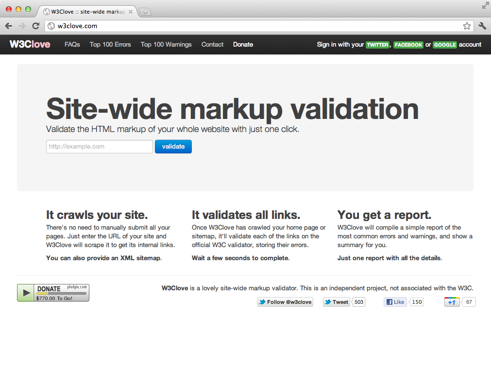

<!SLIDE five-steps-intro>

### Five steps of
# Hypermedia
## API Design

<!SLIDE five-steps lightblue-title padding-bottom>

# Five Steps

1. Evaluate Business Processes
2. Create State Machine
3. Evaluate Media Types
4. Create Media Types
5. Implement!

<!SLIDE lightblue-title padding-bottom>

# A wild example appears!

<!SLIDE w3clove-pic>

<!SLIDE bigcode>

    GET /api/v1/sitemaps/check
      ?uri=http://www.zeldman.com
    
    Host: http://w3clove.com

<!SLIDE>

# Response

    {
      "created_at": "2012-01-30T01:17:04Z",
      "scraped_at": "2012-01-30T01:17:10Z",
      "scraping_success": true,
      "url": "http://www.zeldman.com",
      "web_pages_count": 57,
      "validation_errors_count": 2951,
      "validation_warnings_count": 8,
      "web_pages": [{
        "created_at": "2012-01-30T01:17:09Z",
        "url": "http://www.zeldman.com/",
      ...

<!SLIDE>

    GET /api/v1/web_pages/check
      ?uri=http://www.zeldman.com/2011/12/23/hitler-reacts-to-sopa/
    
    Host: http://w3clove.com

